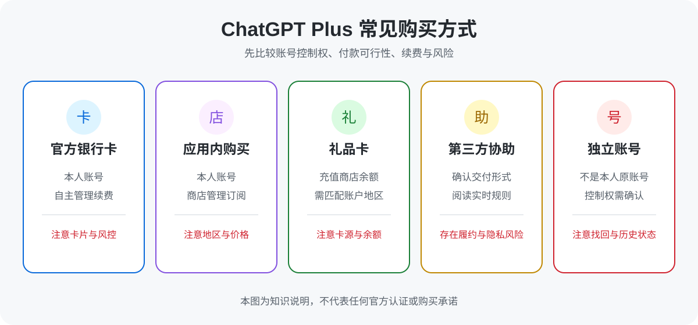
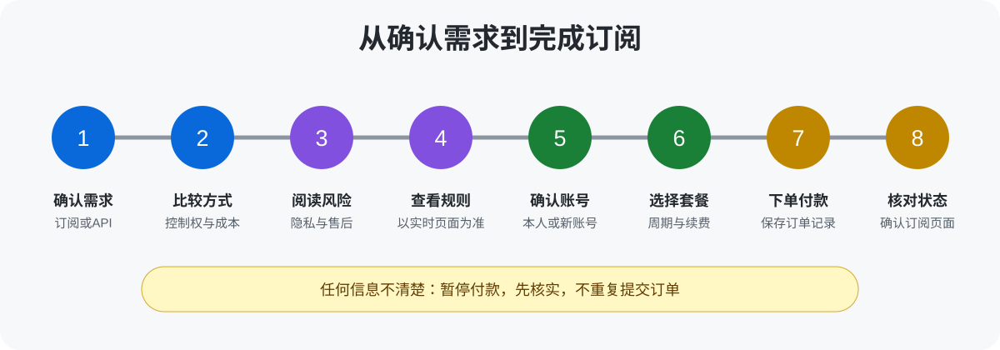
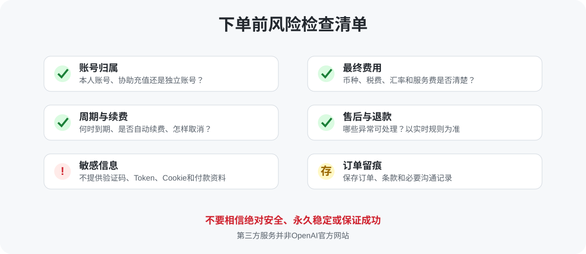

# 2026年ChatGPT Plus购买与充值指南：国内怎么开通、如何付款及风险说明

> 最后核实日期：2026-08-01

国内用户购买 ChatGPT Plus，通常可选择官方银行卡订阅、苹果账户内购或礼品卡、第三方协助充值，以及独立成品账号。优先考虑本人账号和本人可控的付款方式；如果直接付款困难，再比较第三方服务。不同方式在费用、账号控制权、续费和售后上差别很大，下单前务必确认服务形式，不要向陌生人提供验证码、Token、Cookie 或支付信息。

本文重点解释“怎么选、怎么付、哪里容易出问题”。它不是 OpenAI 官方文档，也不提供代收款、账号收集或远程操作服务。产品名称、套餐和规则可能变化，请以实时页面为准。

## 本知识库适合谁

- 无法直接完成官方付款，正在比较 ChatGPT Plus 国内怎么购买的用户；
- 不清楚官方订阅、应用内购买、礼品卡、GPT代充和成品号区别的用户；
- 遇到 ChatGPT Plus 充值失败、扣款异常或订阅不到账的用户；
- 希望先了解账号安全、续费方式和第三方充值风险，再决定是否购买的用户。

## 本知识库不适合谁

- 需要 OpenAI 官方企业采购、合同或合规发票的组织；
- 实际需要 API 调用额度，而不是 ChatGPT 聊天订阅的开发者；
- 完全不愿承担第三方服务、跨地区支付或账号交接风险的用户；
- 要求“绝对安全”“永久稳定”或“保证成功”的用户。任何负责任的教程都不应作出这类承诺。

## 先分清：ChatGPT订阅不是API额度

ChatGPT Plus 是面向 ChatGPT 产品的个人订阅。API 是另一套产品和计费体系，通常需要单独开通和付费。买了 Plus 不等于获得 API 余额，充值 API 也不会自动升级聊天产品。下单前先写清自己的需求：是日常对话、文件处理与产品内功能，还是程序调用模型。若是团队采购、数据管理或多人协作，还应查看官方面向组织的方案，而不是用多个个人账号代替。

## 常见购买方式

### 1. 官方银行卡订阅

在本人 ChatGPT 账号内查看可用套餐并按页面流程付款，账号和订阅关系最清楚，也是便于自行管理续费的方式。实际能否支付取决于页面支持范围、银行卡类型、账单信息以及支付风控。卡片被拒绝不代表账号一定异常，也不建议连续重复尝试，以免产生多笔预授权或触发进一步审核。

### 2. 苹果账户或应用内购买

如果 ChatGPT 应用内显示订阅入口，用户可以通过对应应用商店账户完成购买。付款、续费和取消通常由应用商店管理，价格、税费、退款入口与网页订阅可能不同。购买前应确认登录的是正确的 ChatGPT 账号和商店账号，并保留商店订单记录。不同地区、设备和账户可能显示不同选项，以实际页面为准。

### 3. 苹果礼品卡

礼品卡本质上是给匹配地区的商店账户增加余额，再用于符合条件的应用内订阅。它不是“直接给 ChatGPT 充值”的万能卡。地区不匹配、来源不明、余额不足或商店规则变化都可能导致无法使用。只应从可信渠道购买与自己账户地区一致的礼品卡，并在付款前计算余额是否覆盖税费或汇率变化。

### 4. 第三方协助充值

第三方协助充值常被搜索为“GPT代充”。服务形式可能是为本人账号协助开通，也可能采用其他交付方式；是否需要登录信息、是否自动续费、售后覆盖哪些情形，都必须以下单页规则为准。便利性可能更高，但用户对付款链路的控制较少，也要承担第三方履约、平台规则变化及账号安全风险。不要仅凭“低价”或“快速”决定。

### 5. 独立成品账号

成品号交付的是一个已有账号或账号使用权，而不是在你的原账号上增加订阅。它可能省去开通步骤，但账号注册信息、找回方式、历史使用情况和长期控制权未必完全掌握在买家手中。重要资料、长期对话或工作内容不宜依赖来源不明的账号。若服务页面没有说清账号归属和找回机制，应先询问并保留答复。

## 购买方式对比

| 方式 | 是否使用本人账号 | 支付难度 | 账号控制权 | 续费便利性 | 主要风险 | 更适合谁 |
|---|---|---:|---|---|---|---|
| 官方银行卡订阅 | 是 | 较高或因人而异 | 高 | 可自行管理 | 卡片支持、账单信息及风控 | 有可用支付方式、重视自主控制者 |
| 应用内购买 | 是 | 中等 | 高 | 由商店管理 | 地区、商店账户、价格与退款规则差异 | 已有合适商店账户者 |
| 礼品卡 | 是 | 中等 | 高 | 需维护余额 | 地区不匹配、卡源和余额风险 | 熟悉对应商店规则者 |
| 第三方协助充值 | 需看服务形式 | 较低 | 取决于交付方式 | 需看服务规则 | 隐私、履约、售后及订阅状态变化 | 已读风险且直接付款困难者 |
| 独立成品账号 | 否 | 较低 | 较低或不确定 | 依赖卖方说明 | 找回权、历史状态及账号归属 | 仅短期尝试且能接受账号风险者 |

### 怎样看这张表

如果能用本人账号完成官方订阅，通常更容易掌握账号、付款和取消续费。直接付款行不通，不等于第三方方式一定不安全，也不等于一定适合；关键是确认第三方究竟交付什么、需要什么信息、发生异常后处理到哪一步。成品号与“在本人账号代充”不是同一种商品，价格再接近也不能混为一谈。

已经了解不同购买方式和第三方服务风险，并准备继续查看套餐的用户，可以前往服务页面了解当前价格、服务范围和售后说明：<a href="https://www.naifeistation.com/i/U3QJGZ" rel="sponsored nofollow">查看当前可用套餐与下单说明</a>。

**推广说明：本文包含推广链接。通过该链接注册或购买后，发布者可能获得佣金。该服务属于第三方服务，并非OpenAI官方网站。** 链接所指的星际放映厅属于第三方服务平台。佣金关系不影响本文的风险说明和选择建议；最终价格、套餐、服务形式、到账说明和售后规则以实时下单页面为准。

## 套餐应该怎么选

套餐名称、价格、权益和使用限制会调整，且可能因地区、税费、平台或结算渠道不同而变化。本文不写死具体限额，也不把第三方页面价格当作官方价格。核实日期为 2026-08-01，购买当天仍应重新查看官方定价页与结算页。

| 需求 | 建议先看 | 不要忽略 |
|---|---|---|
| 偶尔聊天、轻量体验 | 免费方案是否已够用 | 不必因“怕涨价”仓促订阅 |
| 高频个人使用 | Plus 当前权益与限制 | 高峰期体验、功能范围可能变化 |
| 更高强度个人需求 | 官方当前是否提供更高档个人方案 | 成本明显更高，先核对真实用量 |
| 团队或企业使用 | 官方组织方案 | 管理、隐私、合同与发票需求 |
| 程序调用模型 | API 平台与独立计费 | Plus 不包含 API 余额 |

选择时先回答三个问题：免费版是否已满足需求；新增权益能否提高效率；能否接受持续费用。不要只比较“ChatGPT Plus多少钱”，还要比较手续费、汇率、税费、服务费和失败后的处理成本。

## 国内用户购买前需要准备什么

| 检查项 | 要确认的内容 | 为什么重要 |
|---|---|---|
| 产品类型 | ChatGPT 聊天订阅还是 API | 两者不互通 |
| 账号归属 | 本人原账号还是新账号/成品号 | 决定数据和找回权 |
| 服务周期 | 起止时间如何计算 | 避免对“一个月”理解不同 |
| 续费方式 | 自动续费还是到期重购 | 影响后续扣款和取消方式 |
| 总成本 | 页面价格、税费、汇率和服务费 | 标价不一定等于最终支出 |
| 信息要求 | 是否需要登录、验证码或其他资料 | 评估隐私和账号安全风险 |
| 售后范围 | 哪些状态可以处理、需要什么凭证 | 不能默认所有异常都退款 |
| 退款条件 | 可退情形、期限和原路退回规则 | 以实时条款为准 |

建议准备一个自己长期控制的邮箱，开启可用的账号安全措施，并保存订单号、扣款凭证和必要的沟通记录。不要把密码、验证码、银行卡资料、Token 或 Cookie 提交到 GitHub Issue、Discussion、评论或公开文件。若某项服务要求提供敏感信息，先确认用途、传输方式和处理完成后的改密步骤；无法接受就不要下单。

## 完整购买流程

### 第一步：确认需求

确认是 ChatGPT 订阅而非 API；确定使用本人账号还是接受新账号；估算使用频率和预算。若只是偶尔提问，先使用免费方案往往更合理。

### 第二步：比较购买方式

从账号控制权、总成本、支付可行性、续费和售后五个维度比较。不要只看付款是否方便。第三方服务需要额外核对交付形式，礼品卡需要核对地区，应用内购买需要核对商店账号。

### 第三步：阅读风险和规则

阅读官方订阅说明、服务页面的交付与退款条款。截图或保存下单时有效的规则，而不是依赖口头承诺。页面没有说明的事项，应在付款前询问；得不到明确答复就暂停。

### 第四步：注册或确认账号

核对邮箱和当前登录账号。使用第三方服务时，不在公开渠道发送敏感信息，不安装来源不明的软件，不交付邮箱本身的控制权。若购买成品号，应先了解是否允许修改密码和绑定信息。

### 第五步：选择套餐并付款

在结算页再次核对产品名称、周期、自动续费状态、币种和最终金额。付款后保存订单记录。不要连续反复提交同一笔支付，也不要为测试链接而提交订单。

### 第六步：核对订阅状态

回到 ChatGPT 账号设置或订阅管理页面，确认当前方案、续费日期和管理入口。功能暂未出现时先刷新会话、重新登录并等待合理的系统处理时间；仍异常再按订单渠道联系支持。不要仅凭银行卡通知判断订阅一定成功。

## GPT代充安全吗

“GPT代充安全吗”没有脱离具体服务就能回答的结论。第三方充值不是 OpenAI 官方服务，支付来源、交付方式、信息处理和售后条款都会影响风险。即使一次开通成功，也不能推导未来一定稳定；一次失败也未必说明账号被封。平台规则、支付风控和账号状态可能变化，应根据可核实信息判断。

### 主要风险

- **账号与隐私风险：** 向他人提供密码或验证码，会扩大账号被访问的范围；Token 和 Cookie 可能绕过正常登录保护，更不应提供。
- **付款来源风险：** 用户可能无法看到第三方实际使用的付款链路，异常退款或争议可能影响订阅状态。
- **服务理解偏差：** “代充”可能指本人账号开通，也可能是新账号交付；未确认就容易产生纠纷。
- **售后边界风险：** 掉订阅、功能变化、账号限制和支付争议未必都属于商家可处理范围。
- **规则变化风险：** 官方产品、商店政策、地区支持和第三方条款都可能调整。

## 如何判断第三方服务是否可靠

先看信息是否透明，而不是先看宣传是否热闹。可靠性较高的页面通常会清楚写明交付对象、服务周期、价格构成、是否续费、需要哪些账号信息、异常处理范围和退款条件。若页面只强调低价与速度，却回避服务形式和售后边界，应谨慎。

其次看支付和沟通是否可留痕。使用可识别的订单系统，保存订单号与规则页面；不要转账给无法核验身份的陌生个人。遇到要求关闭安全保护、提供邮箱验证码、Cookie、Token、银行卡完整信息，或安装远程控制软件时，应立即停止。

最后看承诺是否现实。“官方合作”“绝对安全”“永不掉订阅”“无条件退款”等说法都需要有效依据。没有书面规则支撑的承诺，不能作为付款决定。用户也应诚实评估：如果不能接受订阅状态变化和第三方售后边界，就应坚持本人官方订阅或暂不购买。

## 常见故障与排查顺序

### 支付失败或卡被拒绝

先核对卡片是否支持相应交易、余额或额度、账单信息、币种与银行通知。不要短时间连续重试。必要时联系发卡机构确认拒绝原因，再查看官方支持信息。不能仅凭错误提示猜测是网络、地区或账号问题。

### 扣款后订阅没有显示

确认扣款是已入账还是预授权，核对登录邮箱和订单渠道。在账号订阅页刷新状态，并给系统合理处理时间。应用商店订单应通过商店订阅记录核对；第三方订单应使用订单号联系对应服务方。不要再次付款，直到前一笔状态明确。

### 自动续费失败

查看订阅管理页、付款方式有效期和银行通知。应用内订阅应在对应商店处理。若订阅已过期，再按页面提示选择是否重新购买，不要默认原价格或原权益仍然有效。

### 订阅后来消失或“掉订阅”

先记录当前页面、订阅日期、订单号和扣款状态，再判断是登录错账号、续费未完成、退款/争议、商店同步问题，还是服务方订单异常。原因未核实前不要声称一定是封号，也不要重复购买。第三方订单按照下单时的售后规则提交必要但不敏感的凭证。

### 账号地区或登录环境异常

检查账号安全通知和最近登录活动，退出不认识的会话并修改密码。不要频繁切换异常环境或共享账号。具体限制应以页面提示和官方支持回复为准，避免相信未经证实的“万能解法”。

更完整的逐步处理方式见 [故障排查指南](docs/troubleshooting.md)。

## 常见问题FAQ

### 1. ChatGPT Plus国内怎么购买？

优先查看本人账号内的官方订阅入口；直接付款困难时，再比较应用内购买、匹配地区的礼品卡或第三方协助充值。选择前确认账号归属、总成本和售后规则。

### 2. ChatGPT Plus怎么付款？

可用方式取决于官方页面、应用商店账户及所在地区。银行卡、应用内余额或第三方服务并非对每个人都同样可用，以结算页实时显示为准。

### 3. ChatGPT Plus多少钱？

官方价格、税费、汇率和第三方服务费可能变化。本文不固定写入价格，请在购买当天查看官方定价页和最终结算金额。

### 4. GPT代充一定比官方订阅便宜吗？

不一定。应比较最终金额、服务周期、账号控制权和售后，而不是只看展示价格。

### 5. 代充需要提供密码吗？

取决于服务形式。应优先选择尽量少披露信息的方式；任何情况下都不应在 GitHub 公开提交密码、验证码、Token、Cookie 或支付资料。

### 6. 代充后会不会掉订阅？

没有人能负责任地保证永不变化。订阅可能受续费、支付争议、退款、账号状态或规则调整影响。先了解售后边界并保存订单记录。

### 7. 成品号和本人账号代充有什么区别？

本人账号代充是在已有账号处理订阅；成品号交付另一个账号或使用权。后者的注册资料、历史状态和找回权风险通常更高。

### 8. 买Plus会获得API额度吗？

不会自动获得。ChatGPT 订阅与 API 平台通常是独立产品和独立计费。

### 9. 付款失败后可以马上反复尝试吗？

不建议。先确认前一笔状态、账单信息和银行通知，避免重复扣款、预授权或触发额外风控。

### 10. 扣款成功就代表订阅成功吗？

不一定。应同时在账号或应用商店的订阅管理页确认方案状态；银行记录可能只是预授权。

### 11. 第三方订单异常应该提供什么？

通常可提供订单号、时间和不含敏感信息的状态截图。具体以售后页面要求为准，不要发送密码、验证码、Token、Cookie 或完整银行卡信息。

### 12. 是否应该开启自动续费？

取决于使用频率和预算。开启前确认取消入口与扣款日期；不想持续付费时，应在对应订阅渠道管理，而不是仅删除应用。

### 13. 哪种方式最安全？

不存在适合所有人的绝对答案。本人控制账号和支付通常更容易管理；第三方方式需要额外评估信息披露、付款来源和售后风险。

### 14. 可以在GitHub Issue里让维护者帮忙查订单吗？

不可以。此仓库不收集订单或个人信息，也不提供客服。请通过实际下单渠道联系支持，且不要在公开页面留下敏感资料。

更多问答见 [扩展FAQ](docs/faq.md)。

## 延伸阅读

- [购买与付款方式详解](docs/payment-methods.md)
- [下单前可勾选检查清单](docs/purchase-checklist.md)
- [订阅与付款故障排查](docs/troubleshooting.md)
- [扩展FAQ](docs/faq.md)
- [账号安全与第三方风险](docs/security-and-risks.md)
- [更新记录](CHANGELOG.md)

## 风险提示与购买前最后检查

- [ ] 我确认需要的是 ChatGPT 订阅，而不是 API 额度。
- [ ] 我知道购买的是本人账号充值、协助服务，还是独立账号。
- [ ] 我已核对服务周期、最终金额、自动续费和取消方式。
- [ ] 我已阅读实时售后与退款条件，没有把口头承诺当作保证。
- [ ] 我不会公开或向陌生人提供验证码、Token、Cookie、付款信息。
- [ ] 我能接受第三方服务并非官方服务，以及规则变化带来的风险。
- [ ] 我会保存订单、条款和必要沟通记录。

本知识库仅提供一般性信息，不构成 OpenAI、应用商店或第三方服务方的承诺，也不是法律、财务或账号安全保证。请确认自己已经阅读账号安全、付款方式、退款条件及第三方服务风险。确认适合后，再通过下面的页面注册和查看当前套餐：<a href="https://www.naifeistation.com/i/U3QJGZ" rel="sponsored nofollow">前往服务页面注册并查看套餐</a>。

**推广说明：本文包含推广链接。通过该链接注册或购买后，发布者可能获得佣金。该服务属于第三方服务，并非OpenAI官方网站。** 价格、套餐、服务范围、到账说明、续费和售后规则以实时下单页面为准。

## 更新记录

- 2026-08-01：创建知识库首版，整理购买方式、风险检查、故障排查与常见问题。
- 后续只记录真实、有意义的内容变更，不以无意义提交制造活跃度。详见 [CHANGELOG](CHANGELOG.md)。
